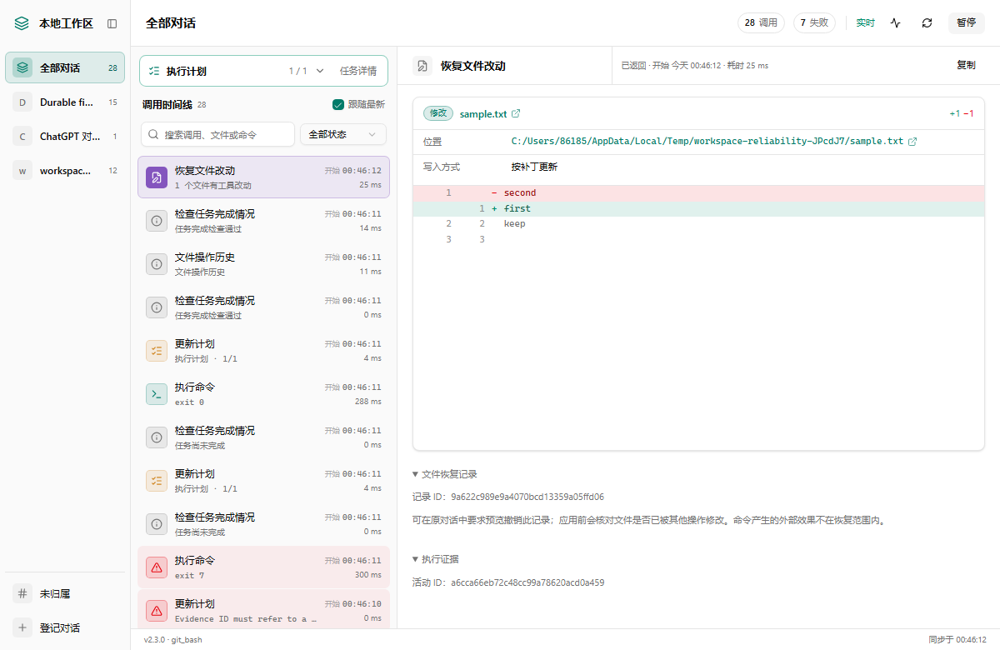

# macOS community fork

This fork adds a native macOS app (**Mac 1.4.1 / upstream core 2.3.0, 28 tools**). See [macOS setup and build instructions](README.macos.md). Original Windows documentation and MIT attribution are preserved below. This is not an official OpenAI application.

## Download for macOS — no build required

1. Open **[the latest macOS release](https://github.com/Ne1ther/chatgpt-local-workspace-macos/releases/latest)** and download `ChatGPT-Codex-Workspace-1.4.1-arm64.dmg` from Assets. ZIP and SHA256 checksums are also available. GitHub's automatic “Source code” archives are not the app.
2. Open the DMG and drag **ChatGPT Codex Workspace** into **Applications**, then launch it.
3. Enter your own Tunnel ID and runtime key in the connection settings and configure the ChatGPT plugin using the [connection guide](README.macos.md#连接-chatgpt).

The package is for **Apple Silicon (M-series), macOS 14 or later**. It includes the local backend and Tunnel Client; users do not need Xcode, Node, Python, or .NET. Git and other development commands still need their own installed tools. An Intel package has not been verified and is not included.

This community build is ad-hoc signed, **not Developer ID signed or notarized**. If macOS blocks the first launch, check the download source and follow [Apple's Open Anyway instructions](https://support.apple.com/en-us/102445). Do not disable Gatekeeper. For updates, explicitly quit the old app and replace it with the new download; preferences and Keychain credentials remain separate from the app bundle.

Source compilation is for development; see [the build section](README.macos.md#从源码构建).

---

# ChatGPT Local Workspace Plugin

<p align="center">
  <a href="LICENSE"></a>
  
  
  
</p>

<p align="center">
  <a href="README.md">简体中文</a> · English
</p>

Let ChatGPT work directly on your machine through the **official OpenAI tunnel**: read and write files, make precise edits, run commands, review Git changes — and open a **live browser dashboard** that shows every tool call as a per-conversation timeline with command output and patch diffs. A single EXE, zero install, no Node.js required at runtime.

> Unofficial community project. Not affiliated with OpenAI.

**What it's for**: drive your machine's files, commands and Git straight from a **ChatGPT web conversation**, with a **standalone live dashboard** that replays every tool call. Unlike the `codex` CLI or `@modelcontextprotocol/server-filesystem`, which live in a terminal / TUI, this runs **inside ChatGPT web** and ships a visual timeline, diffs and command output — no separate terminal, no always-on Node service at runtime. If you want to edit local code from a ChatGPT chat and watch each step, this is it; if you already live in the Codex CLI terminal, you don't need to switch.

| Desktop app: connection & operation log | Live dashboard: call timeline |
| --- | --- |
|  |  |


Release history (newest first): [all upgrade notes](UPGRADE-NOTES.md). Version identifiers and tool counts below refer to each release. The current version is **2.3.0**; follow Quick start below for installation and verification.

## New in 2.3.0: reliable execution and recoverable history

Commands support idempotent retry keys and paginated/tail output. File reads return SHA256; edits and writes support optional version guards and dry-run previews. New `workspace_history` and `restore_change` tools provide conflict-checked undo/redo for direct file changes. Shell and remote effects are outside that restore scope.

Conversation bindings, plans, recent activity and bounded file history are encrypted with Windows DPAPI. Completed steps can reference actual activity IDs. Failure closure requires an explicit issue ID and recovery explanation; a plan timestamp alone cannot clear a failure. Commands and image previews do not survive a restart.

Private Git review baselines leave the normal index and branch untouched. API keys move to Windows Credential Manager when the new desktop app starts. This release reports `version: 2.3.0` / `tool_count: 28`; see [release notes](docs/RELEASE-2.3.0.md) and [tool parameters](docs/TOOLS.md).



Screenshot uses isolated test data. Updating files does not upgrade an already running process; close the old application after its tasks finish, start the new EXE and refresh host tool metadata.

## New in 2.2.1: task details on demand

The plan header now has one subtle **Task details** button. Reasons, next actions and copyable prompts appear only after clicking it. Polling and state changes never reopen a closed panel. You can also send “continue” directly in the original conversation.


Historical execution records stay collapsed. Completed steps without per-step evidence use neutral wording instead of a persistent warning card. Completion checks remain intact; plan-wide explanations are not silently treated as per-step verification. See [2.2.1 release notes](docs/RELEASE-2.2.1.md).


Screenshots use isolated test data.

## New in 2.2.0: task completion checks and continuation prompts

- `check_task_completion` checks pending steps, missing declared evidence, active commands and execution failures not yet acknowledged by a later plan update.
- `update_plan` adds per-step `evidence` and `task_state`, `reason`, `next_action`. Blocked or explicitly user-paused tasks require a concrete reason and next action. Progress-only updates preserve these states.
- Tool receipts include scoped task reminders. Removing unfinished steps requires a scope-change explanation; successful tool calls do not imply task completion.
- After two minutes without observed operations, unfinished tasks show an unconfirmed idle state. A plan step marked in progress alone no longer produces a running spinner.

**Checks use model-declared evidence and local execution state; they do not independently verify the work, prevent a ChatGPT final response or start another turn.** Copying does not send a message or grant new authority. State in 2.2.x was process-local; 2.3.0 adds encrypted persistence. See [2.2.0 release notes](docs/RELEASE-2.2.0.md).

This release reports `version: 2.2.0` / `tool_count: 26`. Track the full task, add actual evidence after verification, then call `check_task_completion` before final delivery. If `can_finish` is false, continue authorized work or record the concrete blocker.

## New in 2.1.0: session grouping, attachments and diagnostics

- **Automatic conversation grouping:** calls carrying official `openai/session` metadata share a local timeline. Clients without that metadata retain explicit registration and `thread_id` support.
- **Chat attachment import:** the new `import_file` tool accepts the official file input contract and creates a new local file, up to 32 MiB, with a size, MIME type and SHA256 receipt. Existing destinations are never overwritten.
- **Concise receipts:** `content` is a short summary; full data is in `structuredContent.result`. Each of the 25 tools declares its output shape. Image reads still return native image content.
- **Connection diagnostics:** the dashboard header and desktop More menu check configuration, tunnel liveness/readiness, handshake, tool discovery, successful calls and session metadata. Unobserved steps remain pending; checks do not restart connections.


The screenshot comes from an isolated local MCP test process, so tunnel checks are unavailable. Synthetic host metadata, real public HTTPS downloads and browser interactions were tested. Session forwarding and attachment selection in an actual ChatGPT account remain host-dependent. Based on the official [plugin reference](https://developers.openai.com/plugins/reference), [MCP server guide](https://developers.openai.com/plugins/build/mcp-server) and [Secure MCP Tunnels guide](https://developers.openai.com/api/docs/guides/secure-mcp-tunnels).

This release reports `version: 2.1.0` / `tool_count: 25`. Starting with this version, custom clients parsing JSON from `content[0].text` must switch to `structuredContent.result`. See [release notes](docs/RELEASE-2.1.0.md).

## Retained from 2.0.2

- **Actual image previews:** inspect the exact PNG, JPEG, GIF or WebP bytes returned by `read_image`, switch between fit and original size, and see dimensions, format, size and location. Later file edits do not change a captured preview.
- **Useful workspace status:** version, executable, dashboard URL, shell, running commands, registered workspace paths and all 24 tools available in 2.0.2 appear in the inspector.
- **Open locations in Windows:** click workspace paths, file details, directory entries, search results, patch paths and command working directories. Directories open in Explorer; files are selected in Explorer; HTTP/HTTPS links open in the default browser. Clicking an executable or script does not run it.
- **Consistent controls:** soft button surfaces replace native black outlines, with visible keyboard focus and light/dark support.

| Image preview | Workspace status |
| --- | --- |
|  |  |

Screenshots use sample data. Image previews live only in the current process, bounded by 100 images or 32 MiB, whichever is reached first. Evicted previews and previews from a previous process require another read. Windows open actions require a same-origin POST and the current process token.

## Features

- **28 local tools**: file read/write, precise edits, multi-file patches, search, command execution with incremental output, Git review, execution plans.
- **Dual-era MCP protocol (v2.0)**: one EXE serves both legacy 2025-06-18 clients (`initialize` handshake — what the ChatGPT Tunnel uses today, compatible handshake and calls) and modern [2026-07-28](https://modelcontextprotocol.io/specification/2026-07-28) stateless clients: `server/discover`, per-request `_meta` version negotiation, `resultType`, cacheable `tools/list` (`ttlMs`/`cacheScope`), MRTR confirmations for destructive operations, the official Tasks extension for long-running commands, OpenTelemetry trace correlation and tool icons.
- **Standalone live dashboard**: a locally compiled React + shadcn/ui single-page app, synced every second, timelines isolated per conversation, inspector rendered per call type (diffs, command output, file content, search hits). The desktop app embeds it in its first tab (WebView2; falls back to the browser when the runtime is missing).
- **One-piece desktop shell**: single-row toolbar (combined start/stop, open in browser, more menu) plus four tabs (workbench / operation log / raw log / connection settings); the log views are owner-drawn with level colors, monospace type and tail-follow.
- **Codex-style workflow**: `open_workspace` reads AGENTS.md conventions → `update_plan` shows real steps → `apply_patch` pre-validates then applies multi-file patches.
- **Single-file distribution**: native .NET Framework 4.8 EXE, listens on 127.0.0.1 only, no remote access.

## Requirements

| Item | Requirement |
| --- | --- |
| OS | Windows 10 / 11 x64 |
| Runtime | .NET Framework 4.8 (built into Win10 1903+) |
| ChatGPT plan | A paid plan that supports **Developer Mode** (Plus / Pro / Team / Enterprise, etc.; check current eligibility), used to create the connector and tunnel |
| Command execution | Git for Windows by default (hidden Git Bash); system PowerShell also selectable explicitly |
| Node.js | Only for building the UI and running tests — not needed at runtime |

> **On platform scope**: Windows-only is a deliberate tradeoff, not an unfinished gap — the goal is a single install-free native EXE that listens on loopback with zero Node/Python runtime dependencies. .NET Framework 4.8 ships with Win10 1903+, so the release needs no runtime install. There is no macOS / Linux build yet.

## Quick start

### 1. Download

Grab the release archive from [Releases](../../releases) and extract it anywhere. Keep `LocalWorkspace.exe` and the official `tunnel-client.exe` side by side.

### 2. Enable Developer Mode and create a connector (the critical step)

This happens in **ChatGPT web**, not in this plugin:

1. **Enable Developer Mode**: sign in to ChatGPT web → Settings → find **Developer Mode** and turn it on. If you don't see the toggle, your plan most likely doesn't include Developer Mode (a paid plan is required) — this is the most common blocker.
2. **Create a connector**: go to ChatGPT's plugins / connectors page (`chatgpt.com/plugins`), click create (+), and add a connector pointing at your local MCP server.
3. **Get the Tunnel ID and API Key**: the official `tunnel-client.exe` bundled in the release bridges your local server to ChatGPT; the connector flow yields the **Tunnel ID** and **API Key** you paste into the desktop app in the next step.

> For the authoritative steps and current UI labels, follow the [OpenAI Apps SDK Quickstart](https://developers.openai.com/apps-sdk/quickstart/) (ChatGPT setting names change between versions). Note: `platform.openai.com/docs` is the **API reference**, not this connector / Developer Mode flow.

### 3. Connect

Launch `LocalWorkspace.exe`, paste the Tunnel ID and API Key, click **Start**. The Tunnel ID is stored in `%LOCALAPPDATA%/LocalWorkspacePlugin/settings.json`; the API key is stored in Windows Credential Manager. Old plaintext keys migrate on startup.

### 4. Refresh the plugin in ChatGPT

Open ChatGPT web → **Settings → Connectors → Local Workspace**, scroll to the bottom and click **Refresh** (this is the developer connection page; if the app detail page only shows "Reconnect", use the settings page instead). The action list should then contain all 28 tools.

### 5. Verify

In a new chat, say:

> Call get_workspace_status to confirm the connection

It should return `version: 2.3.0`, `tool_count: 28`, `protocol_versions`, the actual executable path and this process's instance ID. The desktop log shows `initialize`, `tools/list` and tool receipts in order — "tunnel connected" alone does not prove ChatGPT refreshed the tools.

## Usage (how tools get called)

All tools are invoked automatically by the model — you just describe the task. Typical scenarios:

### File operations

> List the files in E:/projects/demo and change the port in config.json to 8080

→ the model calls `list_directory`, `read_file`, `edit_file`.

### Running commands

> Run npm test in E:/projects/demo and show me the failing output

→ `exec_command` starts it (hidden Git Bash by default); long tasks stream via `poll_command` / `read_command`; `stop_command` terminates when needed.

### Multi-file changes (Codex style)

> First call open_workspace on E:/work/api to load conventions, list a plan with update_plan, then add an export endpoint to the order module following AGENTS.md, and show me a git_diff when done

→ `open_workspace` → `update_plan` → `apply_patch` → `git_status` / `git_diff`. Tools never commit or push on their own.

### Open the live dashboard

After connecting, use the embedded workbench or **Open in browser**. Calls are grouped automatically when the host provides `openai/session`; otherwise, the model registers the conversation and passes its `thread_id`. Titles default to the workspace directory name. State the directory:

> This chat is refactoring the payment module under E:/work/pay

The tool returns a local thread ID and a direct dashboard link; subsequent calls are grouped per conversation in the timeline. Add a title to customize the name, or have the model pass a known `chat_id` to bind the real ChatGPT conversation (the same `chat_id` reuses one thread).

> **Association boundaries:** `openai/session` is an anonymous correlation hint, not a ChatGPT `/c/` ID or authentication. The server hashes organization, subject and session together and persists the association in encrypted local state. Calls without metadata or `thread_id` remain unassigned.

### Save a chat attachment locally

> Save this chat attachment as E:/projects/demo/inbox/requirements.pdf

When the host provides file input, the model uses `import_file`. The destination directory must exist and the destination file must be new. HTTPS download failures do not leave a partial destination. Signed URLs are excluded from local logs and receipts. Once saved, other tools can read or process the file. Host attachment support is required.

## The 28 tools

> Full input parameters, types and return fields are in [docs/TOOLS.md](docs/TOOLS.md). The table below only groups them by purpose.

| Purpose | Tools |
| --- | --- |
| Conversation registration & dashboard deep links | `register_conversation` |
| Standalone activity queries (textual snapshot in chat) | `read_workspace_activity` |
| Workspace conventions, plans & multi-file patches | `open_workspace`, `update_plan`, `apply_patch` |
| Connection, version & activity diagnostics | `get_workspace_status` |
| Task completion check before delivery | `check_task_completion` |
| Directories, file metadata & search | `list_directory`, `file_info`, `search_files`, `search_text` |
| Read text and images | `read_file`, `read_image` |
| Save chat attachments to new local files | `import_file` |
| Create directories, write & precise edits | `create_directory`, `write_file`, `edit_file` |
| File history and conflict-checked undo/redo | `workspace_history`, `restore_change` |
| Run commands, send stdin | `exec_command`, `write_stdin` |
| Command list, incremental output, snapshots, stop | `list_commands`, `poll_command`, `read_command`, `stop_command` |
| Change review | `show_changes`, `git_status`, `git_diff` |

By default, `show_changes` covers edits recorded by this process's file tools. Its `workspace_open` and `last_shown` Git baselines also include external changes and non-ignored new files, using private review refs without changing the normal index or branch. `git_status` / `git_diff` provide the usual Git view (Git diff excludes untracked file bodies).

## Dashboard details

- The left rail lists all conversations, unassigned entries and registered threads; selecting a thread filters timeline, plan and command output, so multiple chats on the same project never mix.
- Each timeline row shows start time, tool, target, status and elapsed time; running calls keep counting. Rows are color-coded per call type; selecting one renders a type-specific inspector: which files were written or replaced and the changed lines, file content (text expands up to 10 KB; binaries are flagged, not dumped), search hits, command output and exit code, or plan progress.
- "Follow latest" is on by default and auto-expands the newest call in the current filter; clicking a historical call pins it.
- Search, status filter, pause/resume (pausing only stops observation, never the task) and copy-registration-command are supported; on connection loss stale results stay visible and flagged.
- Calls without a thread ID land in "Unassigned" — no guessing. Thread grouping is visual isolation, not per-account authorization.
- Activity keeps the latest 100 entries and up to 200 threads in encrypted local state. Unfinished command receipts require reconciliation after restart.

Implementation: sources live in `src/ui/` (React components, Chinese labels in `lib/`), `src/dashboard.css` (Tailwind 4) and `src/dashboard.template.html`. `npm ci && npm run build:ui` compiles CSS with the Tailwind CLI, bundles components with esbuild, and inlines everything into a single `src/dashboard.html` — no CDN, no module loader, no Node at runtime. New builds prefer a `dashboard.html` next to the EXE and fall back to the embedded page.

Old running instances only have the embedded page: observe them read-only via `node scripts/dashboard-preview.cjs http://127.0.0.1:<port>/`, or preview the UI with built-in sample data using `--sample`. This entry never restarts the app or executes tools.

## Command execution details

- Commands run in a hidden Git Bash (`shell: "git_bash"`, legacy alias `bash` accepted). For PowerShell syntax pass `shell: "powershell"` or `"pwsh"` explicitly. A missing Git Bash fails loudly — the interpreter is never swapped silently, and Windows' WSL bash is never mistaken for Git Bash.
- Supports `cmd` / `cwd` / `yield_time_ms` (legacy `command` / `yield_ms` remain compatible); results report the actual shell and executable path.
- `write_stdin` without `chars` continues reading; sending Ctrl-C kills the command tree. Stdin is a pipe, not a PTY. Keep reading the same session for long tasks instead of relaunching.
- Default timeout 300 s (configurable 1–3600 s); output snapshots retain the last 128,000 characters with truncation flagged; a blocked stdin write terminates the command tree with an error so the MCP server never hangs.

## Process visibility

- Tool descriptions carry Chinese call-state text; when the host passes a progressToken, start/heartbeat/finish notifications are sent — unknown totals never show fake percentages.
- The desktop logs call starts immediately, records still-running calls every 2 seconds, and distinguishes results from failures.
- Chat receipts stay textual; visual progress lives in the desktop app's embedded workbench — no card panel is mounted inside ChatGPT anymore.
- Legacy result cards keep text reading, pagination, search, diffs, sessions and image compatibility; stop buttons only kill the corresponding command tree.

## Build from source

```powershell
./build.ps1                                  # builds into dist-next
npm ci; npm run build:ui                     # rebuild the dashboard page
node tests/mcp.test.cjs                      # protocol & tools
node tests/patch.test.cjs                    # patch engine
node tests/activity.test.cjs                 # activity store
node tests/dashboard.test.cjs                # dashboard data
node --test tests/dashboard-ui.test.cjs      # real-browser UI regression
```

`tests/dashboard-ui.test.cjs` drives `src/dashboard.html` in a real browser: timeline, inspector content, plan cards and filters, no horizontal overflow at 1920/1366/640, distinct accent colors per call type in light and dark palettes. The browser is picked by `scripts/browser-launch.cjs` in the order `$env:WORKSPACE_TEST_BROWSER` → bundled Chromium → Chrome → Edge.

Real-tunnel smoke tests require `$env:WORKSPACE_TUNNEL_SMOKE='1'` before `node tests/tunnel.test.cjs`; it reuses existing settings — never run it against a second live instance of the same tunnel.

Key sources: `src/Program.cs` (desktop & tunnel), `src/WorkspaceServer.cs` (protocol & tools), `src/Presentation.cs` (resources & diffs), `src/PatchEditor.cs` (patching), `src/WorkspaceContext.cs` (conventions & plans), `src/WorkspaceActivity.cs` (activity store), `src/ui/` (dashboard). Official DevSpace sources are vendored under `vendor/devspace/` (MIT); the shipped EXE does not depend on its Node service — see [docs/DEVSPACE-SOURCE.md](docs/DEVSPACE-SOURCE.md).

Verification records: [VERIFICATION.md](VERIFICATION.md). Upgrade notes: [UPGRADE-NOTES.md](UPGRADE-NOTES.md).

## Updating

`Apply-Update.ps1` refuses to overwrite while the app or tunnel is running and never kills processes automatically. Close the app first (this ends its command tree), run the update script, then relaunch from the same dist. After tool metadata changes, refresh in ChatGPT settings and **start a new chat** to verify.

## Troubleshooting

**ChatGPT claims it can only read?** Have it call `get_workspace_status` and check version, `tool_count: 28` and connection; then refresh metadata in settings and open a new chat. Don't blame OS permissions for stale chat caches, old plugin versions or a service that isn't running.

**"Tunnel connected" but tools don't respond?** Tunnel connectivity ≠ ChatGPT refreshed the tools. The desktop log must show `initialize` and `tools/list`.

**Panel stuck on "Watching"?** No tool or model call is running right now; model thinking is outside the plugin's visibility and this is not a failure signal.

**"Git Bash not found" from commands?** Install [Git for Windows](https://git-scm.com/download/win), or have the model pass `shell: "powershell"` explicitly.

## Security notes

- The dashboard listens only on a dynamic `127.0.0.1` port; no remote access or execution endpoints are exposed.
- Local disks are accessed with the current Windows user's privileges; the workspace is **not** an OS sandbox — run under a trusted account.
- **There is currently no command-level or path-level guardrail**: `exec_command` runs whatever the model issues with the current user's privileges — no allowlist, and no confirmation prompt even for destructive commands (e.g. `rm -rf`). The file tools refuse path escapes and the tools never auto-`commit`/`push`, but the **shell is unrestricted**. Scope which directories you point the model at and review every step in the live dashboard timeline.
- API keys are stored in Windows Credential Manager. Never share old plaintext configuration or credentials.
- Conversations, plans, recent activity and direct file history are encrypted locally. Command processes, image previews and desktop raw logs remain runtime-local.

## Protocol compatibility

The server is a **dual-era** implementation: it picks its behaviour from how the client opens, and the two paths never interfere.

| Era | Trigger | What you get |
| --- | --- | --- |
| legacy (2025-06-18) | `initialize` handshake (what the ChatGPT Tunnel uses today) | Compatible handshake: 28 tools, progress notifications, structured output |
| modern ([2026-07-28](https://modelcontextprotocol.io/specification/2026-07-28)) | request `_meta` carries `io.modelcontextprotocol/protocolVersion` | Stateless per-request negotiation, `server/discover`, `resultType`, cacheable `tools/list` (`ttlMs`/`cacheScope: private`), `serverInfo` on every result |

Modern-era features activate progressively from the capabilities the client declares:

- **MRTR confirmations for destructive operations**: when the client declares `elicitation`, `apply_patch` and `write_file` overwriting an existing file first return `resultType: "input_required"` with an `elicitation/create` request; the write only happens when the client retries with `inputResponses` + `requestState`. `requestState` is HMAC-SHA256 integrity-protected, bound to the tool name and an argument fingerprint, expires after 10 minutes and is single-use (tamper- and replay-resistant). Clients without the capability see unchanged behaviour.
- **Tasks extension (`io.modelcontextprotocol/tasks`)**: when the client declares the extension, an `exec_command` still running at yield time returns a standard task handle (`resultType: "task"`) pollable via `tasks/get` and cancellable via `tasks/cancel`; clients without it keep the classic `session_id` result.
- **OpenTelemetry**: `traceparent` from request `_meta` is journaled with each call, and the dashboard inspector shows the short trace id for correlation with host-side traces.
- **Tool icons ship in the modern era only**: ChatGPT's legacy connector validation rejects `data:` URI icons, so legacy discovery remains icon-free while exposing the new file input metadata and output schemas.
- Version mismatches return `UnsupportedProtocolVersionError` (-32022); per spec, the modern era no longer answers `ping`.

## Official references

- [OpenAI Apps SDK Quickstart (Developer Mode & connector creation)](https://developers.openai.com/apps-sdk/quickstart/)
- [OpenAI MCP Apps UI & bridging](https://developers.openai.com/plugins/build/chatgpt-ui)
- [Tool metadata, output structure & annotations](https://developers.openai.com/plugins/reference#tool-descriptor-parameters)
- [MCP progress notifications](https://modelcontextprotocol.io/specification/2025-06-18/basic/utilities/progress)
- [MCP 2026-07-28 specification (modern-era basis)](https://modelcontextprotocol.io/specification/2026-07-28)
- [MCP Tasks extension](https://modelcontextprotocol.io/extensions/tasks)
- [DevSpace official source](https://github.com/Waishnav/devspace)

## License & attribution

This is an unofficial open-source project, not affiliated with OpenAI. Released under the MIT license (see [LICENSE](LICENSE)).

- Architecture and tool design reference and partially derive from [Waishnav/devspace](https://github.com/Waishnav/devspace) (MIT); its sources are vendored under `vendor/devspace/` with the original license file.
- `tunnel-client.exe` in release archives is the official OpenAI component (Apache-2.0), distributed via GitHub Releases and not versioned in this repository. Each release pins a specific tunnel-client version — use the one matching that release's notes and don't mix versions across releases.

## Star History

If this project helps you, a Star is appreciated.
